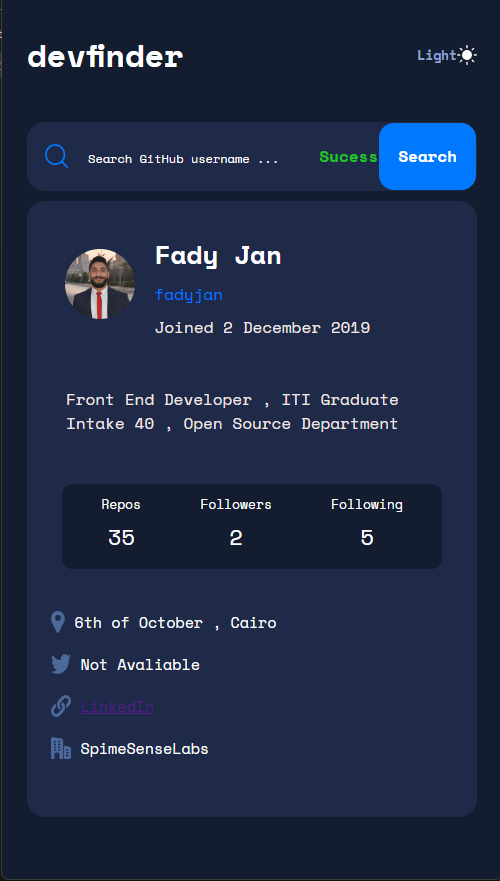

# Frontend Mentor - [GitHub user search app](https://www.frontendmentor.io/challenges/github-user-search-app-Q09YOgaH6)

## Deployed Site
[GitHub user search app](https://github-user-search-website-react.vercel.app/)

## Summary

[Frontend Mentor](https://www.frontendmentor.io) challenge to recreate the [GitHub user search app](https://www.frontendmentor.io/challenges/github-user-search-app-Q09YOgaH6) using React

## Technology Used
#### Front-end
- React
- HTML
- CSS
- Figma
- Vercel for Deployment

## React Component Structure
- index.js
    - src/App.js
        - SearchBar 
        - Header
        - Github Info
        - LoadingSpinner
        
## Brief About the project

- View the optimal layout for the app depending on their device's screen size
- See hover states for all interactive elements on the page
- Search for GitHub users by their username
- See relevant user information based on their search
- Switch between light and dark themes
